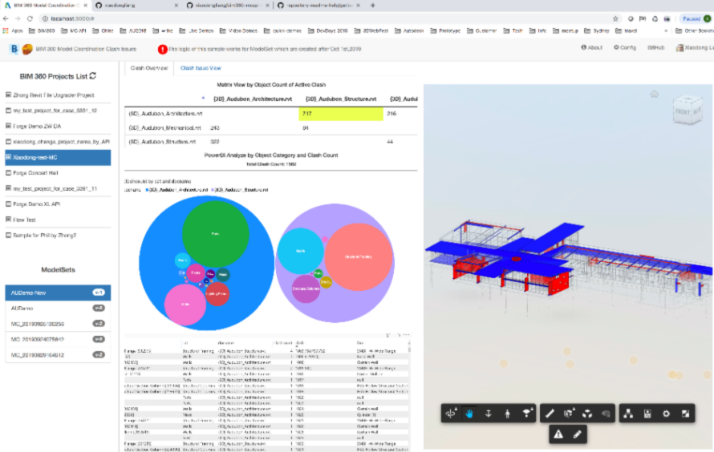

# BIM 360/ ACC  Model Coordination: PowerBI report

This repository demonstrates the scenario: analyze clash data and clash issue by BIM 360 /ACC Model Coordination API with [PowerBI](https://powerbi.microsoft.com/en-us/). It includes 2 modules:

- [PowerBITool](./PowerBITool/README.md) is the tool for prepraring the relevant data of PowerBI report. 
- [WebSample](./WebSample/README.md) is the source project of this sample. 

 Note: This demo uses [large RVT sample files](https://github.com/xiaodongliang/Demo-Test-Sample-Files/tree/master/Model%20Coordination%20API).

## Thumbnail

  
# Demonstration

Recording: [this video](https://youtu.be/pQaO2Dta97g) on how to use this demo.

## License

This sample is licensed under the terms of the [MIT License](http://opensource.org/licenses/MIT). Please see the [LICENSE](LICENSE) file for full details.

## Written by

- Xiaodong Liang [@coldwood](https://twitter.com/coldwood),Develope Advocacy and Support,Autodesk
- Reviewed by Jaime Rosales Duque [@AfroJme](https://twitter.com/AfroJme), Develope Advocacy and Support,Autodesk

